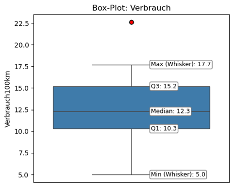
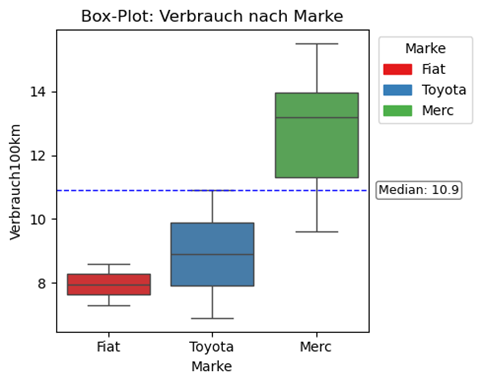
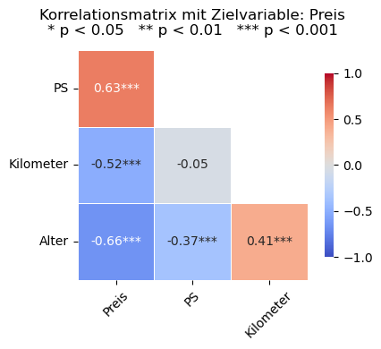

<!-- README.md is generated from README.Rmd. Please edit that file -->

# pythonforbusiness

<!-- badges: start -->
<!-- badges: end -->

The goal of the package pythonbusiness is to support the readers of the
book “Künstliche Intelligenz für das Business: Anwendungsentwicklung mit Python” with samples, functions and tutorials as described in the book.

The function ml_summary() automatically evaluates the main descriptive statistical figures for a variable.
The function ml_plot() creates different forms of visualizations.

## Installation

You can install the package python from [GitHub](https://github.com/)
with:

``` r
# install.packages("devtools")
devtools::install_github("bheesen/pythonforbusiness")
library(pythonforbusiness)
```

## Tutorials

You can start the tutorials of the package with the following commands:

``` r
ml.tutorial(name = "py.syntax")
ml.tutorial(name = "py.datenstrukturen")
ml.tutorial(name = "py.operationen")
ml.tutorial(name = "py.kontrollstrukturen")
ml.tutorial(name = "py.funktionen")
ml.tutorial(name = "py.standardfunktionen")
```

## Example

This is an example using some of the functions included in the package:

``` python
## ml_summary(): Statistics of a variable-----------------------------------------
summary = ml_summary(flug['dep_delay'], "Verspätung beim Abflug", "Minuten")
```

📊 Summary für: Verspätung beim Abflug (Minuten)
typ           : numerisch
anzahl        : 336,788
anzahl.valid  : 328,521
anzahl.na     : 8,267
modus         :     -5.00
median        :     -2.00
mean          :     12.64
min           :    -43.00
max           :   1301.00
sd            :     40.21
q1            :     -5.00
q3            :     11.00
iqr           :     16.00
whisker.min   :    -29.00
whisker.max   :     35.00
skewness      :      4.80
skewness.txt  : Rechte Schiefe: 4.80 > 0, positive Schiefe, linkssteil, rechtsschief
kurtosis      :     46.95
kurtosis.txt  : Steilgipflig mit Exzess Kurtosis 46.95 > 0

``` python
## ml_plot: Visualization---------------------------------------------------------
ml_plot(mtcars, column="Verbrauch100km", kind="box", title="Box-Plot: Verbrauch")
ml_plot(mtcars_filtered, column=("Marke", "Verbrauch100km"),
        kind="box", legend=True, title="Box-Plot: Verbrauch nach Marke")
ml_plot(df=autos, column=["Preis", "PS", "Alter", "Kilometer"], kind="cormatrix")      
```

/>

The `README.Rmd` file was used to create this `README.md` file using the
function `devtools::build_readme()`.
