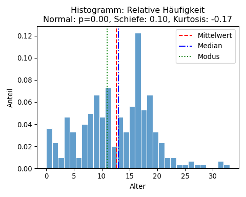

<!-- README.md is generated from README.Rmd. Please edit that file -->

# pythonforbusiness

<!-- badges: start -->
<!-- badges: end -->

The goal of the package pythonforbusiness is to support the readers of
the book “Künstliche Intelligenz im Business: Erstellung eigener
Anwendungen mit Python” with samples, functions and tutorials as
described in the book.

As part of the preprocessing of data The function ml_summary()
automatically evaluates the main descriptive statistical figures for a
variable and the function ml_plot() supports different forms of
visualizations useful for preprocessing (correlation plots, box plots…)
as well as model evaluation (AUC plot, Scatter plot with regression
line). All of the visualizations can be seen when executing the file
ml_demo.py.

The Python code can be found in the directory
<https://github.com/bheesen/pythonforbusiness/tree/main/Python> and the
same is true for the data used in the book (except that the dataframes
in the file datasets.joblib are limited to 20.000 data records per
dataframe).

## Installation of R package as a prerequisite to perform the tutorials

You can install the package pythonforbusiness from
[GitHub](https://github.com/) with:

``` r
# install.packages("devtools")
devtools::install_github("bheesen/pythonforbusiness")
library(pythonforbusiness)
```

## Tutorials

You can start the tutorials of the package with the following commands
in R:

ml.tutorial(name = "py.syntax"), 
ml.tutorial(name = "py.datenstrukturen"), 
ml.tutorial(name = "py.operationen"), 
ml.tutorial(name = "py.kontrollstrukturen"), 
ml.tutorial(name = "py.funktionen"), 
ml.tutorial(name = "py.standardfunktionen")

## Example demo of the function ml_summary and ml_plot

This is an example using some of the functions included in the package:

``` python
## ml_summary(): Statistics of a variable-----------------------------------------
# Numerische Variable
summary = ml_summary(flug["dep_delay"], 
                     titel="Verspätung beim Abflug", 
                     einheit="Minuten")
#> 
#> 📊 Summary für: Verspätung beim Abflug (Minuten)
#> typ           : numerisch
#> anzahl        : 20,000
#> anzahl.valid  : 19,651
#> anzahl.na     : 349
#> modus         :     -3.00
#> median        :     -2.00
#> mean          :     12.87
#> min           :    -23.00
#> max           :    898.00
#> sd            :     43.21
#> q1            :     -5.00
#> q3            :      9.00
#> iqr           :     14.00
#> whisker.min   :    -26.00
#> whisker.max   :     30.00
#> skewness      :      5.55
#> skewness.txt  : Rechte Schiefe: 5.55 > 0, positive Schiefe, linkssteil, rechtsschief
#> kurtosis      :     54.64
#> kurtosis.txt  : Steilgipflig mit Exzess Kurtosis 54.64 > 0
# Kategoriale Variable vollständig oder nur Top-N mit/ohne Prozent
summary, freq = ml_summary(flug["carrier"], 
                           titel="Fluggesellschaft", 
                           einheit="Anzahl Flüge", 
                           top_n=3)
#> 
#> 📊 Summary für: Fluggesellschaft (Anzahl Flüge)
#> typ           : kategorial
#> anzahl        : 20,000
#> anzahl.valid  : 20,000
#> anzahl.na     : 0
#> unique        : 9
#> 🧾 Häufigkeitstabelle Top-N(3):
#> DL                  :    10,831 ( 54.2%)
#> FL                  :     2,337 ( 11.7%)
#> MQ                  :     2,322 ( 11.6%)
```

``` python
## ml_plot(): Visualization-------------------------------------------------------
# Plot mit vier automatisch gewählten Farbpaletten-----------------------------
fig, axes = plt.subplots(1, 4, figsize=(15, 4))
ml_plot(df_demo, "Gruppe", kind="bar", title=f"Nominal: {ml_colour_nom}", ax=axes[0])
ml_plot(df_demo, "Wert", kind="bar", title=f"Ordinal: {ml_colour_ord}", ax=axes[1])
ml_plot(df_demo, "Stimmung", kind="bar", title=f"Spektral (>3 Werte): {ml_colour_spect}", ax=axes[2])
ml_plot(df_demo, "Bewertung", kind="bar", title="Spektral (3 Werte): Ampel", ax=axes[3])
plt.tight_layout(); plt.show()
```


``` python

#%%%% Typen von Plots----------------------------------------------------------
# Histogramm
ml_plot(df=autos, column="Alter", kind="hist_density", 
        title="Histogramm: Relative Häufigkeit")
plt.tight_layout(); plt.show()
```



``` python

# Q-Q-Plot
ml_plot(autos, column="Alter", kind="qq", 
        title="Quantile-Quantile-Plot")
plt.tight_layout(); plt.show()
```


``` python

# Bar-Chart
ml_plot(df=autos, column="Marke", kind="bar", 
        title="Bar-Chart: Absolute Häufigkeit je Kategorie", legend=True)
plt.tight_layout(); plt.show()
```


``` python

# Stack Column-Chart 100%
ml_plot(df=autos_anzahl, column=("Marke", "Kategorie"), kpi="Anzahl",
        title="100%-Stacked Column-Chart: Relative Häufigkeit je Kategorie", 
        kind="stack100column", legend=True)
plt.tight_layout(); plt.show()
```


``` python

# Line-Chart
ml_plot(df=df_zeitreihe, column=("Minuten", "Variable"), kpi="Wert", 
        kind="line", title="Line-Chart: df_zeitreihe")
plt.tight_layout(); plt.show()
```


``` python

# Box-Plot
ml_plot(mtcars, column="Verbrauch100km", 
        kind="box", title="Box-Plot: Verbrauch")
plt.tight_layout(); plt.show()
```


``` python

# Box-Plot gruppiert
ml_plot(mtcars_filtered, column=("Marke", "Verbrauch100km"), 
        kind="box", legend=True, title="Box-Plot: Verbrauch nach Marke")
plt.tight_layout(); plt.show()
```


``` python

# Korrelationsmatrix
ml_plot(df=autos, column=["Preis", "PS", "Alter", "Kilometer"], 
        kind="cormatrix")
plt.tight_layout(); plt.show()
```


``` python

# Scatter-Plots nebeneinander
fig, axes = plt.subplots(1, 3, figsize=(15, 5))
ml_plot(autos, ("Kilometer","Preis"), kind="scatter", 
        title="Scatter-Plot: Kilometer in 1000 vs. Preis", ax=axes[0])
ml_plot(autos, ("Alter","Preis"), kind="scatter", 
        title="Scatter-Plot: Alter vs. Preis", ax=axes[1])
ml_plot(autos, ("PS","Preis"), kind="scatter", 
        title="Scatter-Plot: PS vs. Preis", ax=axes[2])
plt.tight_layout(); plt.show(); plt.close(fig)
```


``` python

# Scatter-Joint
ml_plot(df=mtcars, column=("Gewicht", "Verbrauch100km"), kind="scatterjoint", 
        title="Joint-Plot: Gewicht vs. Verbrauch auf 100 km")
plt.tight_layout(); plt.show()
```


``` python

# Scatter-Plot (einfach) und mit Gruppierung
ml_plot(df=mtcars_filtered, column=("Gewicht","Verbrauch100km","Marke"), 
        kind="scatter", 
        title="Scatter-Plot: Gewicht in kg vs. Verbrauch auf 100 km", 
        legend=True)
plt.tight_layout(); plt.show()
```


``` python

# Pairplot gruppiert
ml_plot(df=mtcars_filtered, 
        column={"vars": ["Gewicht", "Verbrauch100km", "Zylinder"], "hue": "Marke"}, 
        kind="pairplot", title="Pairplot: Verbrauch, Gewicht, Zylinder nach Marke")
plt.tight_layout(); plt.show()
```


``` python

# Confusion Matrix
fig, ax = plt.subplots(figsize=(5, 4))
ml_plot(df=df_auc, column=("true", "pred"), kind="confmat", 
        title="Konfusionsmatrix (Positiv=Kunde kauft)", ax=ax)
plt.tight_layout(); plt.show(); plt.close(fig)
```


``` python

# AUC Plot
fig, ax = plt.subplots(figsize=(5, 4))
ml_plot(df=df_auc, column=("true", "prob"), kind="auc", 
        title="'Kunde kauft'", ax=ax)
plt.tight_layout(); plt.show(); plt.close(fig) 
```


The `README.Rmd` file was used to create this `README.md` file using the
function `devtools::build_readme()`.
