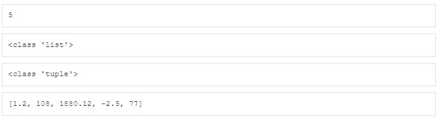
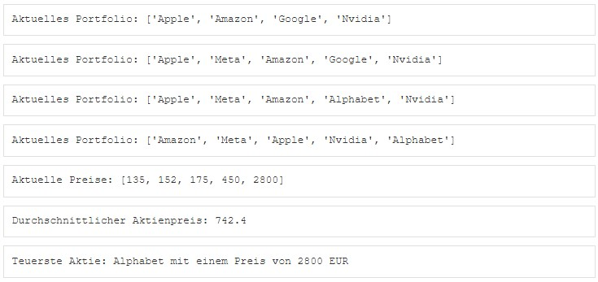
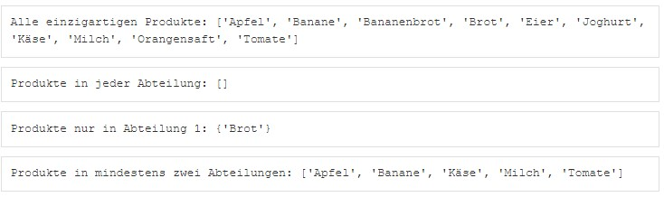
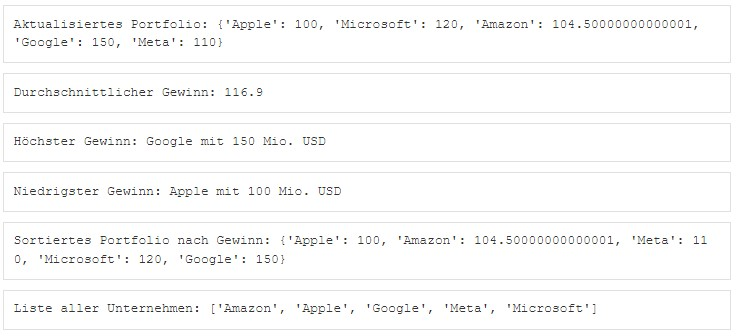
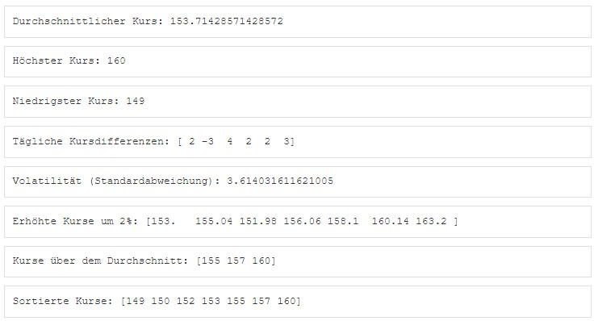
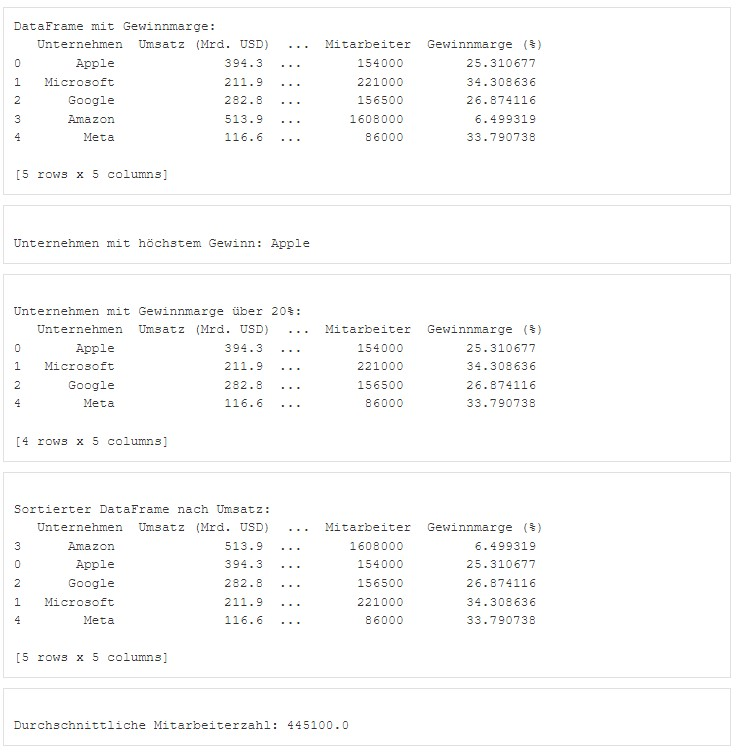

```{r setup, include=FALSE}
library(learnr)
library(reticulate)
library(pythonforbusiness)
```

## Willkommen

Dieses Tutorial ergänzt die Inhalte des Buches [_Künstliche Intelligenz im Business: Erstellung eigener Anwendungen mit Python_](https://www.amazon.de/K%C3%BCnstliche-Intelligenz-Business-Erstellung-Anwendungen/dp/3658495448). Das Kapitel 5.2 im Buch beschreibt die Datenstrukturen von Python.

Wird nur ein einzelner Wert in einer Variablen gespeichert, so bezeichnet man diese als einfache Variable bzw. elementaren Datentyp. Werden mehrere Werte in einer Variablen gespeichert, so bezeichnet man diese als Vektor bzw. Datenstruktur. 

Die wichtigsten nicht elementaren Datentypen, also Datenstrukturen, in Python sind: **Liste (list)** und **Tupel (tuple)** sind Vektoren aus einer geordneten Liste von Elementen, welche unterschiedlichen Typs sein können. Die einzelnen Elemente lassen sich über einen Index ansprechen.**Set (set)** sind Mengen von nicht geordneten Elementen, bei denen doppelte Elemente nicht vorkommen.	**Dictionary (dict)** sind Lexika, d.h. es gibt einen Schlüsselbegriff (key), dem etwas zugeordnet wird, ähnlich einem Wörterbuch, bei dem einem Wort dessen Übersetzung zugeordnet wird. **Array (Ndarray)** sind N-dimensionale Arrays, welche besonders für die Verarbeitung von numerischen Arrays sehr verbreitet sind. Um diese Datenstruktur nutzen zu können muss zuvor das Paket numpy installiert sein. **Dataframe (dataframe)** und **Serie (series)** sind 2-dimensionale Dataframes, welche besonders für die Verarbeitung von Tabellen sehr verbreitet sind. Um diese Datenstruktur nutzen zu können muss zuvor das Paket pandas installiert sein.

Nachfolgend werden die Vektoren vom Datentyp Liste, Tupel, Set, Dictionary, Array, Dataframe und Serie näher beschrieben.

## 1. Listen und Tupel

Liste (list) und Tupel (tuple) sind Vektoren aus einer geordneten Liste von Elementen, welche unterschiedlichen Typs sein können. Die einzelnen Elemente lassen sich über einen Index ansprechen. 

Eine Liste wird mit eckigen Klammern definiert und besteht aus einer Folge von Elementen, die auch unterschiedlichen Typs sein können, z.B. l1=[1.2, -13, 46, 1880.12, -2.5, 77]. Listen können beliebige Datentypen enthalten, auch wieder Listen, z.B. l2=["Text",43.88,570] und l3=[[81,9],"Ansbach",512,l2]. In Python werden die Nachkommastellen wie im Englischen üblich mit einem Punkt getrennt und nicht wie im Deutschen mit einem Komma. Kommas werden dagegen verwendet, um die Argumente einer Liste, eines Tupels oder einer Funktion voneinander zu trennen.

Tupel unterscheiden sich von Listen dadurch, dass die Inhalte nicht veränderbar sind und sie mit runden Klammern initialisiert werden, also z.B. t1=("Siemens","Bosch","SAP"). Tupel verfügen lediglich über die Methoden count(), welche die Anzahl des Vorkommens eines Wertes zählt und index(), welche den Index des ersten Vorkommens eines Wertes bestimmt.

Auch ein Intervall von Zeichen einer Zeichenkette lässt sich über einen Von-Index und Bis-Index angeben, wobei ein Doppelpunkt die beiden Indizes voneinander trennt, z.B. l1[0:4], um die Zeichen 1 bis 3 der Liste l1 anzuzeigen. Bei der Angabe von Intervallgrenzen ist die untere Intervallgrenze inkludiert, die obere Intervallgrenze jedoch exkludiert.

Eine Liste oder ein Tupel kann durch Eingabe des Namens angezeigt werden. Auf einzelne Elemente eines Vektors kann durch Indizierung in eckigen Klammern zugegriffen werden, wobei die Indizierung bei 0 startet, z.B. l1[2] gibt den dritten Wert der Liste l1 aus, hier also 46. Das Voranstellen eines Minuszeichens vor den Index bewirkt, dass dieser vom Ende der Liste nach vorne gezählt wird, z.B. l1[-2] zeigt das vorletzte Elemente an. Es können auch mehrere Werte eines Vektors unter Angabe von Intervallgrenzen ausgegeben werden, z.B. die Elemente 3 bis 5 mit der Anweisung l1[2:4]. Bei der Angabe von Intervallgrenzen ist die untere Intervallgrenze inkludiert, die obere Intervallgrenze jedoch exkludiert. Das Weglassen einer Intervallgrenze, z.B. l1[:2] zeigt alle Elemente bis zum Zweiten und l1[3:] zeigt alle Elemente ab dem Dritten an. Der zweifache Doppelpunkt gibt eine Schrittgröße an, z.B. Die Anweisung l1[::-1] zeigt alle Elemente der Liste von hinten nach vorne an und l1[1::2] zeigt beginnend mit dem zweiten Element (Index 1) jedes zweite nachfolgende Element an.

Die Funktion len() gibt die Anzahl der Elemente einer Liste oder eines Tupels zurück. Dies kann auch zur Berechnung der Indizes verwendet werden. Möchte man z.B. auf das vorletzte Element zugreifen, so kann man dies mit der Anweisung l1[len(l1)-2] erreichen.

```{python 1}
l1=list()                                 # Liste ohne Inhalt
l1                                        
l1=[1.2, -13, 46, 1880.12, -2.5, 77]      # Liste
l1                                        
l1[0]                                     # Ausgabe 1. Element 
l1[2]                                     # Ausgabe 3. Element
l1[2:4]                                   # Ausgabe 3.-4. Element
l1[:2]                                    # Ausgabe bis 2. Element
l1[3:]                                    # Ausgabe ab dem 3. Element
l1[1::2]                                  # Ausgabe 2. Element und jedes 2.
l1[::-1]                                  # Ausgabe von hinten nach vorne
l1[-2]                                    # Ausgabe vorletztes Element
len(l1)                                   # Anzahl Elemente von Liste
l1[len(l1)-2]                             # Ausgabe vorletztes Element
l2=["Text",43.88,570]                     # Liste mit verschiedenen Datentypen
l2
l3=[[81,9],"Ansbach",512,l2]              # Liste mit Listen als Element
l3
l3[3]
## Tupel--------------------------------------------------------------------------
t1=("Schweinsteiger","Lahm","Lahm")       # Tupel
t1
t1[2]                                     # Ausgabe 3. Element
## Liste ändern möglich-----------------------------------------------------------
l1
l1[0]=20
l1
## Tupel ändern nicht möglich-----------------------------------------------------
t1
#t1[0]="BMW"
```

### 1.1 Methoden

Listen verfügen über die Methoden append() zum Hinzufügen eines Elements, extend() zum Hinzufügen aller Elemente einer anderen Liste, pop() zum Entfernen eines Elements über den angegebenen Index, remove() zum Entfernen eines Elements mit dem angegebenen Inhalt und sort() zum Sortieren der Elemente einer Liste.

```{python 1_1}
## Methoden für Tupel: count, index-----------------------------------------------
t1
t1.count("Lahm")                          # Häufigkeit von Element
t1
t1.index("Lahm")                          # Index von erstem Vorkommen
## Methoden für Listen: append, extend, pop, remove, sort-------------------------
l1
l1.append("neu1")                         # Ein Element anfügen
l1
l2
l1.append(l2)                             # Ein Element anfügen
l1
l1.extend(l2)                             # Alle Elemente einer Liste anfügen
l1
l1=l1+l2                                  # Alle Elemente einer Liste anfügen
l1
l1+=l3                                    # Alle Elemente einer Liste anfügen
l1
l1.pop()                                  # Löscht Element; ohne Index letztes E.
l1
l1.pop(2)                                 # Löscht 3. Element
l1
l1.remove("neu1")                         # Löscht Element mit spezifischem Wert
l1
l1=[1.2, -13, 46, 1880.12, -2.5, 77]      # Liste von Zahlen
l1.sort()
l1
l4=["Zumba","Walzer","Foxtrott"]          # Liste von Strings
l4.sort()
l4
```

### 1.2 Entschachteln von geschachtelten Listen

Listen können selbst wieder Listen als Elemente enthalten und somit ineinander geschachtelt sein, wie z.B. eine Matrix. Nachfolgend wird gezeigt, wie derartige Listen mit der Funktion itertools.chain.from_iterable() entschachtelt werden können.

```{python 1_2}
import itertools
## Entschachteln von geschachtelten Listen: itertools.chain.from_iterable---------
matrix=[[700,5,62.43],[500.70,8,22]]
matrix
type(matrix)
len(matrix)
matrixwerte=list(itertools.chain.from_iterable(matrix)) 
print(matrixwerte)
type(matrixwerte)
len(matrixwerte)
## Entpacken von Listen und Tupeln: Variablenzuweisung * steht für "mehrere"------
l5=["BMW","Porsche","Audi","VW"]          # Liste
x1,*x2,x3=l5                              # Entpacken von Liste l5
x1
type(x1)                                  # String
x2
type(x2)                                  # Liste
x3
type(x3)                                  # String
t5=("BMW","Porsche","Audi","VW")          # Tupel
x1,*x2,x3=t5                              # Entpacken von Tupel t5
x1
type(x1)                                  # String
x2
type(x2)                                  # Liste
x3
type(x3)                                  # String
```

### 1.3 Konstante als Klasse

Tupel bieten auch die Möglichkeit eine Konstante Liste zu definieren. Wenn eine Variable nur eine kleine Anzahl von benennbaren Zuständen hat, z.B. Wochentage, Monate oder Noten, dann können mit dem Paket enums (enumeration bzw. Aufzählung) Konstantenklassen festgelegt werden.

```{python 1_3}
import enum
class wochentag(enum.Enum):               # Definition von Konstante
    Montag = 1
    Dienstag = 2
    Mittwoch = 3
    Donnerstag = 4
    Freitag = 5
    Samstag = 6
    Sonntag = 7
class note(enum.Enum):                    # Definition von Konstante
    sehr_gut = 1
    gut = 2
    befriedigend = 3
    ausreichend = 4
    mangelhaft = 5
wochentag(2)
wochentag["Samstag"]
len(wochentag)
note(4)
len(note)
for tag in wochentag:                     # Schleife über Konstante
    print(tag)
for tag in wochentag:                     # Schleife über Konstante
    print(tag,": Name:",tag.name,"=",tag.value)
for bewertung in note:                    # Schleife über Konstante
    print(bewertung)
```

### 1.4 Übung zu Listen

Erstellen Sie eine Liste l1 mit den Elementen 1.2, -13, 1880.12, -2.5 und 77. Lassen Sie sich anzeigen wie viele Elemente die Liste hat. Erstellen Sie anschließend das Tupel mit dem Namen t1, welches die gleichen Inhalte wie die Liste l1 haben soll. Lassen Sie sich den Typ der Datenstrukturen mit dem Namen l1 und t1 anzeigen.
Ändern Sie das zweite Element der Liste l1 ab, so dass es den Wert 108 ist und lassen Sie sich anschließend die Liste anzeigen.

Die Anzeige sollte hinterher wie folgt aussehen: 

```{python 1-4, exercise=TRUE}
```
```{python 1-4-hint-1}
l1=[1.2, -13, 1880.12, -2.5, 77]
len(l1)
t1=(1.2, -13, 1880.12, -2.5, 77)
type(l1)
type(t1)
```
```{python 1-4-hint-2}
l1[1]=108
l1
```

### 1.5 Übung zu Listen

Ein Investor verwaltet ein Portfolio mit verschiedenen Aktien. Die Aktien und ihre aktuellen Preise (in USD) sind in einer Liste gespeichert.

```{python 1_5-setup, echo=TRUE, exercise=FALSE}
aktien = ["Apple", "Microsoft", "Amazon", "Google"]
preise = [175, 320, 135, 2800]
```

Aufgabenstellung: Ein neuer Wert soll zum Portfolio hinzugefügt werden: Nvidia mit einem Preis von 450.
Der Investor verkauft seine Microsoft-Aktien. Entferne Microsoft und den zugehörigen Preis aus den Listen. Zeige das Portfolio an. Füge eine neue Aktie Meta mit dem Wert 152 hinzu, aber an zweiter Stelle in der Liste. Zeige das Portfolio erneut an.
Ein Fehler wurde entdeckt: Google sollte eigentlich Alphabet heißen. Ändere den Namen in der Liste und zeige das Portfolio ein weiteres mal an.
Berechne den durchschnittlichen Aktienpreis im Portfolio. Sortiere das Portfolio nach den Aktienpreisen (niedrigster Preis zuerst). Finde die teuerste Aktie im Portfolio. Füge eine neue Aktie Meta mit dem Wert 152 hinzu, aber an zweiter Stelle in der Liste.

Die Anzeige sollte hinterher wie folgt aussehen: 

```{python 1_5, exercise=TRUE, exercise.lines=7, exercise.setup="1_5-setup"}
```
```{python 1_5-hint-1}
aktien.append("Nvidia")
preise.append(450)
index_microsoft = aktien.index("Microsoft")
del aktien[index_microsoft]
del preise[index_microsoft]
print("Aktuelles Portfolio:", aktien)
aktien.insert(1, "Meta")
preise.insert(1, 152)
print("Aktuelles Portfolio:", aktien)
index_google = aktien.index("Google")
aktien[index_google] = "Alphabet"
print("Aktuelles Portfolio:", aktien)
```
```{python 1_5-hint-2}
durchschnittspreis = sum(preise) / len(preise)
aktien_preise = list(zip(aktien, preise))
aktien_preise.sort(key=lambda x: x[1])  # Sortierung nach Preis
aktien, preise = zip(*aktien_preise)
aktien = list(aktien)
preise = list(preise)
teuerste_aktie = aktien[-1]
teuerster_preis = preise[-1]
```
```{python 1_5-hint-3}
print("Aktuelles Portfolio:", aktien)
print("Aktuelle Preise:", preise)
print("Durchschnittlicher Aktienpreis:", durchschnittspreis)
print("Teuerste Aktie:", teuerste_aktie, "mit einem Preis von", teuerster_preis, "EUR")
```

## 2. Set

Ein Set ist eine Menge von Elementen, die ihre Elemente genau einmal beinhaltet. Ein Set wird in geschweiften Klammern angegeben, z.B. s1={1,2,3,4,5}.

Sets verfügen über die Methoden union() zur Erstellung einer Gesamtmenge, intersection() zur Erstellung einer Schnittmenge, difference() zur Erstellung einer Differenzmenge und add() zum Hinzufügen von Elementen zu einem Set.

```{python 2}
## Set----------------------------------------------------------------------------
s1={1,2,3,4,5}                            # Set
s1
l1=["Götze","Schweinsteiger","Müller"]    # Liste
s2 = set(l1)                              # Set aus Liste bilden
type(s2)
s2
t1=("Schweinsteiger","Lahm","Lahm","Lahm")# Tupel
s3 = set(t1)                              # Set aus Tupel bilden
type(s3)
s3
## Methoden für Set: union, intersection, difference, add-------------------------
s2.union(s3)                              # Gesamtmenge
s3.union(s2)
s2.intersection(s3)                       # Schnittmenge
s3.intersection(s2)
s2.difference(s3)                         # Differenz
s3.difference(s2)
s2
s2.add("Neuer")                           # Hinzufügen
s2
```

### 2.1 Übung Sets erstellen und Gesamtmenge/Schnittmenge/Differenz

Ein Supermarkt möchte eine Liste seiner einzigartigen Produkte aus verschiedenen Abteilungen erstellen. Gegeben sind folgende Produktlisten:

```{python 2_4-setup, echo=TRUE, exercise=FALSE}
abteilung_1 = {"Apfel", "Banane", "Tomate", "Milch", "Brot"}
abteilung_2 = {"Milch", "Joghurt", "Käse", "Banane", "Eier"}
abteilung_3 = {"Apfel", "Bananenbrot", "Käse", "Orangensaft", "Tomate"}
```

Aufgabenstellung: Erstellen Sie eine Menge alle_produkte, die alle einzigartigen Produkte aus allen Abteilungen enthält. Bestimmen Sie die Produkte, die in jeder Abteilung vorkommen (gemeinsame_produkte). Finden Sie heraus, welche Produkte nur in der ersten Abteilung vorkommen (nur_in_abteilung_1). Finden Sie die Produkte, die in mindestens zwei Abteilungen vorkommen (in_mindestens_zwei). Geben Sie die Produkte jeweils mit der Funktion sorted() nach dem Alphabet sortiert aus.

Die Anzeige sollte hinterher wie folgt aussehen: 

```{python 2_4, exercise=TRUE, exercise.lines=7, exercise.setup="2_4-setup"}
```
```{python 2_4-hint-1}
alle_produkte = abteilung_1 | abteilung_2 | abteilung_3           # Vereinigung
print("Alle einzigartigen Produkte:", sorted(alle_produkte))
```
```{python 2_4-hint-2}
gemeinsame_produkte = abteilung_1 & abteilung_2 & abteilung_3     # Schnittmenge
print("Produkte in jeder Abteilung:", sorted(gemeinsame_produkte))# Leer
```
```{python 2_4-hint-3}
nur_in_abteilung_1 = abteilung_1 - (abteilung_2 | abteilung_3)    # Differenz
print("Produkte nur in Abteilung 1:", sorted(nur_in_abteilung_1))
```
```{python 2_4-hint-4}
in_mindestens_zwei = (abteilung_1 & abteilung_2) | (abteilung_1 & abteilung_3) | (abteilung_2 & abteilung_3)
print("Produkte in mindestens zwei Abteilungen:", sorted(in_mindestens_zwei))
```

## 3. Dictionary

Ein Dictionary ist ein Lexikon, welches aus einem Schlüssel (key) und dem Schlüssel zugeordneten Attributen besteht, so wie etwa bei einem Wörterbuch, bei dem einem Wort dessen Übersetzung und Beschreibung zugeordnet wird. Einem Schlüssel können auch mehrere Attribute zugeordnet sein und Attribute können beliebigen Datentyps sein. Ein Dictionary wird in geschweiften Klammern angegeben, wobei die Einträge aus dem Schlüssel und einem durch Doppelpunkt getrennten Bereich für die Attribute bestehen, z.B. note1={'sehr gut': 1, 'gut': 2, 'befriedigend': 3, 'ausreichend': 4, 'mangelhaft': 5}. Alternativ kann auch die Funktion dict() verwendet werden, z.B. note2=dict(sehrgut=1,gut=2,befriedigend=3,ausreichend=4,mangelhaft=5). Es kann auch geschickt sein im Vorfeld zwei Listen mit den Schlüsselfeldnamen und den Daten anzulegen, um diese dann mit der Funktion  dict() zu verbinden, z.B. kunde = dict(zip(kunde_keys, kunde_wert)). Hinweis: Ein Schlüsselfeld bei Dictionaries darf keine Zahl sein.

```{python 3}
note1={                                   # Dictionary
    "sehr gut": 1,
    "gut": 2,
    "befriedigend": 3,
    "ausreichend": 4,
    "mangelhaft": 5,
}
type(note1)
note1
note2=dict(sehrgut=1,gut=2,befriedigend=3,ausreichend=4,mangelhaft=5)
type(note2)
note2
bewertung = {                             # Dictionary
 "sehr gut": 2,
 "gut": 1,
 "neutral": 0,
 "schlecht": -1,
 "sehr schlecht": -2,
}
type(bewertung)
bewertung
bewertung["schlecht"]                     # Anzeige Attribut über Key
bewertung["sehr schlecht"]=-3             # Ändern Attribut
bewertung["sehr gut"]=3
bewertung["ohne Wertung"]=0               # Hinzufügen Key + Attribut
bewertung
```

### 3.1 Komplexe Dictionaries

Wenn zu einem Schlüssel mehrere Attribute in einem Dictionary hinterlegt werden, beispielhaft eine Telefonnummer und E-Mail-Adresse je Kunde, dann werden die Werte in eckigen Klammern durch Komma getrennt angegeben, z.B. kunden = {"Stefan Schmidt": ["0172-98654", "s.schmidt@web.de"], "Melanie Meier": ["0151-77432", "m.meier@web.de"],}.

```{python 3_1}
# Kunden-Angaben = "Name", "Telefonnummer", "E-Mail", "Umsatz", "TOP-Kunde"
kunde_keys = ("Name","Telefonnummer","E-Mail","Umsatz","TOP-Kunde")
kunde_wert = ["Stefan Schmidt","0172-98654","s.schmidt@web.de",56000,True]
kunde = dict(zip(kunde_keys, kunde_wert)) # Dictionary
kunde
kunde["E-Mail"]
# Kunden-Angaben mit mehr als einem Attribut je Key
kunden = {                                # Dictionary
 "Stefan Schmidt": ["0172-98654", "s.schmidt@web.de"],
 "Melanie Meier": ["0151-77432", "m.meier@web.de"],
}
type(kunden)
kunden
kunden["Melanie Meier"]
```

### 3.2 Methoden für Dictionaries

Die einzelnen Einträge werden nicht über einen Index, sondern über den Schlüssel angesprochen, z.B. bewertung["schlecht"]. Die items()-Methode eines Dictionary erstellt eine vollständige Liste von Key-Value-Paaren (Datentyp dict_items) eines Dictionary, z.B. bewertungitems=bewertung.items(). Um eine Liste aller Werte eines zu erstellen, benutzt man die Funktion values, z.B. list(bewertung.values()). Um eine Liste aller Schlüssel zu erstellen wird die Funktion keys() verwendet, z.B. list(bewertung.keys()).

```{python 3_2}
## Methoden für Dictionary: items, update, get, keys, values----------------------
bewertung_items=list(bewertung.items())
type(bewertung_items)
bewertung_items
#  Sortierung nach Key (Index 0)
bewertung_items_sortiert={key:value for (key,value) in sorted(list(bewertung.items()), key=lambda x:x[0])}
bewertung_items_sortiert
#  Sortierung nach Attribut (Index 1)
bewertung_items_sortiert={key:value for (key,value) in sorted(list(bewertung.items()), key=lambda x:x[1])}
bewertung_items_sortiert
bewertung.update({"nicht teilgenommen":0})# Hinzufügen Key + Attribut
bewertung
#  Methode get sucht Eintrag, falls nicht existiert erfolgt Meldung Parameter 2
bewertung.get("sehr gut","Eintrag nicht vorhanden")
bewertung.get("super gut","Eintrag nicht da")
bewertung_keys=list(bewertung.keys())
bewertung_keys
bewertung_attribute=list(bewertung.values())
bewertung_attribute
```

### 3.3 Übung zu Dictionaries

Ein Investor besitzt Anteile an verschiedenen Unternehmen. Die Gewinne der Unternehmen (in Millionen USD) sind in einem Dictionary gespeichert:

```{python 3_3-setup, echo=TRUE, exercise=FALSE}
unternehmen = {
    "Apple": 100,
    "Microsoft": 120,
    "Tesla": 85,
    "Amazon": 95,
    "Google": 150
}
```

Aufgabenstellung: Füge Meta mit einem Gewinn von 110 Millionen EUR als neues Unternehmen hinzu. Der Investor verkauft seine Anteile an Tesla. Entferne Tesla aus dem Dictionary.Der Gewinn von Amazon ist um 10% gestiegen. Aktualisiere den Wert. Bestimme den durchschnittlichen Gewinn aller Unternehmen.Ermittle das Unternehmen mit dem höchsten und niedrigsten Gewinn. Gib das Portfolio sortiert nach Gewinnen (aufsteigend) aus. Erstelle eine Liste aller Unternehmensnamen aus dem Dictionary und gib die Namen sortiert nach Alphabet aus.

Die Anzeige sollte hinterher wie folgt aussehen: 

```{python 3_3, exercise=TRUE, exercise.setup="3_3-setup"}
```
```{python 3_3-hint-1}
unternehmen["Meta"] = 110
del unternehmen["Tesla"]
unternehmen["Amazon"] *= 1.10  # 10% Erhöhung
durchschnittsgewinn = sum(unternehmen.values()) / len(unternehmen)
```
```{python 3_3-hint-2}
hoechstes_unternehmen = max(unternehmen, key=unternehmen.get)
niedrigstes_unternehmen = min(unternehmen, key=unternehmen.get)
unternehmen_sortiert = dict(sorted(list(unternehmen.items()), key=lambda x: x[1]))
unternehmensnamen = list(unternehmen.keys())
```
```{python 3_3-hint-3}
print("Aktualisiertes Portfolio:", unternehmen)
print("Durchschnittlicher Gewinn:", durchschnittsgewinn)
print("Höchster Gewinn:", hoechstes_unternehmen, "mit", unternehmen[hoechstes_unternehmen], "Mio. USD")
print("Niedrigster Gewinn:", niedrigstes_unternehmen, "mit", unternehmen[niedrigstes_unternehmen], "Mio. USD")
print("Sortiertes Portfolio nach Gewinn:", unternehmen_sortiert)
print("Liste aller Unternehmen:", sorted(unternehmensnamen))
```

## 4. Arrays mit NumPy

Arrays (Datentyp: Ndarray) sind N-dimensionale Arrays, welche besonders für die Verarbeitung von numerischen Arrays sehr verbreitet sind. Um diese Datenstruktur nutzen zu können muss zuvor das Paket numpy installiert sein. 

Ein Array kann auf Basis einer Liste oder eines Tupels erzeugt werden, z.B.  a1=np.array(l1), wenn die Liste l1 als Basis verwendet wird. Der Datentyp kann durch den Parameter dtype festgelegt werden, z.B. np.array(l1,dtype=np.uint8). Eine Liste der in numpy verfügbaren Datentypen findet sich auf der Webseite des Pakets Numpy. Die Funktion dtype() dient dazu den Datentyp eines Arrays anzuzeigen.

Funktionen zur Erzeugung von eindimensionalen Arrays sind arange() und linspace(). Für mehrdimensionale Arrays bieten sich die Funktionen eye(), zeros(), ones() und default_rng(nn).random() an, wobei nn eine Seedzahl für die Generierung von Zufallszahlen festlegt, so dass Python unabhängig von Ort, Zeit und Benutzer immer die gleichen Zufallszahlen liefert.

Auf die Elemente eines Arrays kann via Index zugegriffen werden, z.B. a2[0,0], um auf die Zelle in der ersten Zeile und ersten Spalte zuzugreifen.

Mit der Funktion ndim() wird die Anzahl der Dimensionen angezeigt und mit der Funktion shape() wird für alle mehrdimensionalen Arrays auch die Anzahl der Zeilen und Spalten etc. angezeigt. Die Anzahl der Array-Elemente kann durch die Funktion size() erfolgen und der Arbeitsspeicherbedarf für ein Array wird durch die Funktion nbytes() angezeigt.

Im Machine Learning ist es oft auch erforderlich ein Array zu transponieren (um die Diagonale spiegeln), was mit Unterstützung der Funktion T() möglich ist.


```{python 4}
import numpy as np                   # Numpy
from numpy.random import default_rng # Zufallszahlengenerator
l1=[1,2,3,4]
a1=np.array(l1)                      # Array auf Basis von Liste
type(a1)
a1
#  Datentyp für Elemente im Array festlegen: Numpy Datentypen 
#  siehe https://numpy.org/doc/stable/user/basics.types.html
a1=np.array(l1,dtype=np.uint8)       # Datentyp integer
a1
a1=np.array(l1,dtype=np.single)      # Datentyp 8Bit Exponent, 23Bit Mantisse
a1
#  Array erzeugen lassen
np.arange(0,10)                      # Array von,bis
np.arange(3,5,0.4)                   # Array von,bis,Inkrement
np.linspace(1,5,7)                   # Array von,bis,Anzahl(gleicher Abstand)
np.eye(3)                            # 2DArray Anzahl Zeilen=Spalten, Diag=1
np.zeros((2,3))                      # 2DArray Anzahl Zeilen,Spalten, 0
np.zeros((2,3,2))                    # 3DArray Anzahl Zeilen,Spalten,Dim, 0
np.ones((2,4))                       # 2DArray Anzahl Zeilen,Spalten, 1
np.ones((2,4,2))                     # 3DArray Anzahl Zeilen,Spalten,Dim, 1
default_rng(87).random((2,4))        # 2DArray Anzahl Zeilen,Spalten, random
default_rng(87).random((2,4,2))      # 3DArray Anzahl Zeilen,Spalten,Dim, random
#  Indexierung
a2=default_rng(12345).random((3,4))  # 2DArray Anzahl Zeilen,Spalten, random
a2
a2[0,0]                              # Zelle Zeile 1, Spalte 1
a2[1]                                # Zeile 2
a2[1,:]                              # Zeile 2
a2[1:3,2]                            # Zeile 2 bis 3, Spalte 3
a2[:,3]                              # Spalte 4
#  Dimenstionen und Shape
a2.ndim                              # Anzahl Dimensionen
a2.shape                             # Anzahl Zeilen/Spalten
a2.dtype                             # Datentyp
a2.size                              # Anzahl Array-Elemente
a2.nbytes                            # Arbeitsspeicherbedarf in Bytes
a2.T                                 # Transponiertes Array
a2
```

### 4.1 Übung zu Arrays

Ein Investor verfolgt die täglichen Schlusskurse einer Aktie über eine Woche hinweg. Diese sind in einem NumPy-Array gespeichert:

```{python 4_4-setup, echo=TRUE, exercise=FALSE}
import numpy as np
aktienkurse = np.array([150, 152, 149, 153, 155, 157, 160])
```

Aufgabenstellung: Berechnen Sie den durchschnittlichen Aktienkurs über die Woche. Was sind die höchsten und niedrigsten Kurse? Berechnen Sie die Differenzen zwischen aufeinanderfolgenden Tagen. Bestimmen Sie die Standardabweichung (Volatilität) der Kurse. Erhöhen Sie alle Kurse um 2%, um eine hypothetische Preissteigerung zu simulieren. Finden Sie heraus, an welchen Tagen der Kurs über dem Durchschnitt lag. Sortieren Sie die Kurse aufsteigend..

Die Anzeige sollte hinterher wie folgt aussehen: 

```{python 4_4, exercise=TRUE, exercise.lines=3, exercise.setup="4_4-setup"}
```
```{python 4_4-hint-1}
durchschnitt = np.mean(aktienkurse)
max_kurs = np.max(aktienkurse)
min_kurs = np.min(aktienkurse)
kursdifferenzen = np.diff(aktienkurse)
volatilitaet = np.std(aktienkurse)
aktienkurse_erhoeht = aktienkurse * 1.02
```
```{python 4_4-hint-2}
ueber_durchschnitt = aktienkurse[aktienkurse > durchschnitt]
sortierte_kurse = np.sort(aktienkurse)
print("Durchschnittlicher Kurs:", durchschnitt)
print("Höchster Kurs:", max_kurs)
print("Niedrigster Kurs:", min_kurs)
print("Tägliche Kursdifferenzen:", kursdifferenzen)
print("Volatilität (Standardabweichung):", volatilitaet)
print("Erhöhte Kurse um 2%:", aktienkurse_erhoeht)
print("Kurse über dem Durchschnitt:", ueber_durchschnitt)
print("Sortierte Kurse:", sortierte_kurse)
```

## 5. DataFrames und Serien mit Pandas

Dataframes und Serien sind häufig verwendete Datenstrukturen, wobei eine Datenreihe (Series) einer Spalte in einer Datentabelle (Dataframe) entspricht. Ein Dataframe besteht aus mehreren Series-Objekten und jede Serie kann einen anderen Datentyp besitzen. Die beiden vorgenannten Datenstrukturen sind in dem Paket pandas enthalten.

Ein Dataframe kann mit der Funktion DataFrame() erstellt werden. Als Basis für die Inhalte können u.a. Arrays, Listen oder Dictionarys verwendet werden.

```{python 5}
## Dataframe----------------------------------------------------------------------
import pandas as pd                        # Paket pandas
## Dataframe aus Array------------------------------------------------------------
from numpy.random import default_rng       # Zufallszahlengenerator
a1=default_rng(12345).random((8,3))        # 8x3 Zahlen Range [0, 1) Seed 12345
type(a1)                                   # Numpy Array
a1.shape                                   # 8 Zeilen, 3 Spalten
a1
spalten,zeilen=["Spalte1","Spalte2","Spalte3"],range(1,9)
df1=pd.DataFrame(a1,columns=spalten,index=zeilen)
type(df1)
df1

## Dataframe aus Liste------------------------------------------------------------
l1=["Berlin","Bremen","München","Frankfurt"]# Liste l1 (Niederlassung)
l2=[123,200,356,123]                        # Liste l2 (Stückzahl Verkauf)
l3=(53,22,31,26)                            # Liste l3 (Warenbestand)
spalten=['Niederlassung','Stückzahl',"Warenbestand"]
df2=pd.DataFrame(list(zip(l1,l2,l3)),columns=spalten)
type(df2)
df2
## Dataframe aus Dictionary-------------------------------------------------------
# dictionary of lists 
d1={'Niederlassung':l1,'Stückzahl':l2,'Warenbestand':l3} 
type(d1)
d1   
df3=pd.DataFrame(d1)
type(df3)
df3
```

### 5.1 Methoden für Dataframes

Methoden für Dataframes sind shape() zur Anzeige der Dimensionen (Zeilen,Spalten), head() für die Anzeige der ersten n Zeilen, tail() für die Anzeige der letzten n Zeilen, dtypes() für die Anzeige der Datentypen der Spalten, columns() für die Anzeige der Spaltennamen, index() für die Anzeige der Zeilennamen, values() für die Anzeige der Inhalte und drop(), um eine Zeile bzw. Spalte zu löschen. Auf welcher Achse man die Methode drop anwenden möchte wird durch den Parameter axis angegeben, wobei der Wert „0“ für Zeilenwerte (index) und der Wert „1“ für Spaltennamen (columns) verwendet wird.

Der Zugriff und die Änderung von Zellen eines Dataframes erfolgt durch die Methoden at() via Namen, iat() via Index und der Zugriff auf Zeilen durch die Methoden loc() via Namen und iloc() via Index. Beim Zugriff via Index gilt es zu berücksichtigen, dass der Index sich durch die Sortierung ändern kann, wenn bei den Methoden sort_index() und sort_values() der Parameter inplace=True verwendet wird (True sorgt dafür, dass die Operation direkt im Arbeitsspeicher erfolgt, während False bewirkt, dass eine Kopie des Objekts zurückgegeben wird und das Originalobjekt im Arbeitsspeicher unverändert bleibt). Auf einzelne Spalten eines Dataframes erfolgt der Zugriff über die Angabe des Dataframenamens und dem Spaltennamen, z.B. df3.Ort. 

Der Zugriff auf Inhalte eines Dataframes kann auch selektiv durch Bedingungen eingeschränkt sein, z.B. df3[df3.Stückzahl>100], um nur die Zeilen eines Dataframes anzuzeigen, welche eine Stückzahl > 100 haben.

Um einen ersten Überblick über die Daten eines Dataframes oder Series-Objektes zu erhalten ist die Methode describe() geeignet.  Die Methode zeigt für alle numerischen Spalten die Anzahl, den Mittelwert, die Standardabweichung, das Minimum, Maximum und die Quartile an.

```{python 5_1}
## Methoden für Dataframes: dtypes, head, tail, columns, index, values, drop------
df3.shape                                    # Dimensionen Zeilen/Spalten
df3.dtypes                                   # Datentypen der Spalten
df3.head(2)                                  # Erste n Zeilen
df3.tail(3)                                  # Letzte n Zeilen
df3.columns                                  # Spaltennamen anzeigen
df3.columns=['Ort','Stückzahl',"Bestand"]    # Spaltennamen ändern
df3
df3.index                                    # Zeilennamen anzeigen
df3.index=["Headq.","Nord","Süd","Mitte"]    # Zeilennamen ändern
df3
df3.values                                   # Zelleninhalt anzeigen
df3["Vorstand"]=["John Meier","Mark Schmidt",# Neue Spalte
   "Anne Ruf","Julia Hof"]
df3
df3.drop("Vorstand",axis=1,inplace=False)    # Spalte löschen (nur für Ergebnis)
df3
df3.drop("Vorstand",axis=1,inplace=True)     # Spalte löschen (im Arbeitsspeicher)
df3
for spalte in df3.columns[1:3]:              # Neue Spalten: Abw. von Mittelwert
  name=f"{spalte}_Abw.Mw"
  df3[name]=df3[spalte]-df3[spalte].mean()   # Abweichung von Mittelwert
df3
df3.columns
## Zugriff und Änderung via Methoden: at, iat, loc, iloc--------------------------
#  Indexierung Zeile/Spalte
df3.Ort                                      # Spalte Ort
df3["Ort"]
df3.at["Nord","Ort"]                         # Zeile/Spalte via Name
df3.iat[1,0]                                 # Zeile/Spalte via Index
df3.at["Headq.","Stückzahl"]                 # Zeile/Spalte via Name
df3.at["Headq.","Stückzahl"]=66              # Element ändern
df3
df3.loc["Nord"]                              # Zeile via Name
df3.iloc[1]                                  # Zeile via Index
df3.loc["Headq.":"Süd",["Ort","Stückzahl"]]  # Slicing via Name
df3.iloc[0:3,0:2]                            # Slicing via Index
df3.loc["Headq.":"Süd",["Ort","Stückzahl"]]  # Slicing via Namensliste
df3.iloc[0:3,[0,1]]                          # Slicing via Indexliste
df3.loc["Headq.":"Mitte":2,df3.columns[0:2]] # Slicing mit Start:Stop:Abstand
df3.iloc[1:4:2,0:2]            
#  Sortieren via Methoden: sort_index, sort_values
df3
df3.loc["Nord"]                              # Zeile via Name -> Bremen
df3.iloc[1]                                  # Zeile via Index-> Bremen
df3.sort_index(inplace=True)                 # Sortieren nach Zeilennamen
df3
df3.loc["Nord"]                              # Zeile via Name -> Bremen
df3.iloc[1]                                  # Zeile via Index-> Frankfurt
df3.sort_values("Stückzahl",ascending=False,inplace=True)  # Stückzahl absteigend
df3
df3.loc["Nord"]                              # Zeile via Name -> Bremen
df3.iloc[1]                                  # Zeile via Index-> Bremen
df3.sort_values(["Bestand","Ort"]            # Stückzahl+Ort absteigend
                ,ascending=False,inplace=True)

df3
df3.loc["Nord"]                              # Zeile via Name -> Bremen
df3.iloc[1]                                  # Zeile via Index-> München
#  Boolean Indexierung (Bedingungen)
df3[df3.Ort=="Bremen"]                       # Bedingung "Bremen"
df3[df3.Stückzahl>100]                       # Bedingung "Stückzahl > 100"
```

### 5.2 Serien

Die Spalte eines Dataframes kann mit der Methode Series() extrahiert werden, um die weitere Analyse zu erleichtern. Auch auf Series kann mit den Methoden loc() und iloc() zugegriffen werden.

```{python 5_2}
## Series aus Dataframe erstellen-------------------------------------------------
s1=pd.Series(df3.Stückzahl)                  # Serie aus Dataframe erstellen
type(s1)
s1
s1["Nord"]
s1.loc["Nord"]                               # Zeile via Name -> Bremen
s1.iloc[1]                                   # Zeile via Index-> München
#  Serie aus Ndarray erstellen----------------------------------------------------
a1=np.arange(3,5,0.4)                        # Ndarray
type(a1)
a1
s2=pd.Series(a1)
type(s2)
s2
s2.index                                     # Index
s2.dtype                                     # Datentyp
s2.shape                                     # Dimension
a2=s2.values                                 # Export in Ndarray
type(a2)
a2
a3=s2.array                                  # Export in Numpy Extension Array
type(a3)
a3
```

### 5.3 Übung zu Dataframes und Serien

Sie sind ein Finanzanalyst und möchten die Gewinne verschiedener Technologieunternehmen im vergangenen Jahr analysieren. Nutzen Sie Pandas, um die Daten in dem DataFrame df zu verarbeiten.

```{python 5_4-setup, echo=TRUE, exercise=FALSE}
import pandas as pd
daten = {
    "Unternehmen": ["Apple", "Microsoft", "Google", "Amazon", "Meta"],
    "Umsatz (Mrd. USD)": [394.3, 211.9, 282.8, 513.9, 116.6],
    "Gewinn (Mrd. USD)": [99.8, 72.7, 76.0, 33.4, 39.4],
    "Mitarbeiter": [154000, 221000, 156500, 1608000, 86000]
}
df = pd.DataFrame(daten)
```

Aufgabenstellung: Berechnen Sie die Gewinnmarge (%) für jedes Unternehmen und fügen Sie diese als neue Spalte hinzu (Gewinnmarge = (Gewinn / Umsatz) * 100). Bestimmen Sie das Unternehmen mit dem höchsten Gewinn. Filtern Sie alle Unternehmen mit einer Gewinnmarge über 20%. Sortieren Sie den DataFrame nach Umsatz in absteigender Reihenfolge. Berechnen Sie die durchschnittliche Mitarbeiterzahl der Unternehmen.

Die Anzeige sollte hinterher wie folgt aussehen: 

```{python 5_4, exercise=TRUE, exercise.lines=7, exercise.setup="5_4-setup"}
```
```{python 5_4-hint-1}
df["Gewinnmarge (%)"] = (df["Gewinn (Mrd. USD)"] / df["Umsatz (Mrd. USD)"]) * 100
unternehmen_max_gewinn = df.loc[df["Gewinn (Mrd. USD)"].idxmax(), "Unternehmen"]
df_hohe_marge = df[df["Gewinnmarge (%)"] > 20]
df_sortiert = df.sort_values(by="Umsatz (Mrd. USD)", ascending=False)
```
```{python 5_4-hint-2}
durchschnitt_mitarbeiter = df["Mitarbeiter"].mean()
print("DataFrame mit Gewinnmarge:\n", df)
print("\nUnternehmen mit höchstem Gewinn:", unternehmen_max_gewinn)
print("\nUnternehmen mit Gewinnmarge über 20%:\n", df_hohe_marge)
print("\nSortierter DataFrame nach Umsatz:\n", df_sortiert)
print("\nDurchschnittliche Mitarbeiterzahl:", durchschnitt_mitarbeiter)
```

## 6. Quiz 

```{r 6, echo = FALSE}
quiz(
  question("Welche Datenstruktur speichert geordnete, aber unveränderliche Werte?",
    answer("Tupel", correct = TRUE),
    answer("Liste", correct = FALSE)
  ),
  question("Welche Methode wird verwendet, um ein Element zu einer Liste hinzuzufügen?",
    answer("append()", correct = TRUE),
    answer("add()", correct = FALSE)
  ),
  question("Wie kann man die Anzahl der Elemente in einer Liste bestimmen?",
    answer("len()", correct = TRUE),
    answer("count()", correct = FALSE)
  ),
  question("Welche Datenstruktur speichert Schlüssel-Wert-Paare?",
    answer("Dictionary", correct = TRUE),
    answer("Set", correct = FALSE)
  ),
  question("Welche Methode wird für die Vereinigung von zwei Sets verwendet?",
    answer("union()", correct = TRUE),
    answer("merge()", correct = FALSE)
  ),
  question("Wie greift man auf eine Spalte in einem Pandas DataFrame zu?",
    answer("df['Spaltenname']", correct = TRUE),
    answer("df.Spalteliste", correct = FALSE)
  ),
  question("Welche Methode gibt den ersten Eintrag eines DataFrames aus?",
    answer("head()", correct = TRUE),
    answer("first()", correct = FALSE)
  ),
  question("Welche Eigenschaft unterscheidet ein Set von einer Liste?",
    answer("Sets enthalten keine doppelten Werte", correct = TRUE),
    answer("Sets sind geordnet", correct = FALSE)
  ),
  question("Welche Bibliothek wird für DataFrames in Python verwendet?",
  answer("Pandas", correct = TRUE),
  answer("NumPy", correct = FALSE)
  )
)
```

## Ende 

Gratulation!

Sie haben dieses Tutorial erfolgreich ausgeführt und einen ersten Einblick in die Datenstrukturen der Programmiersprache Python erhalten.