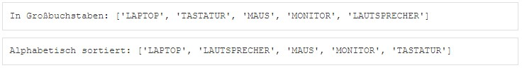
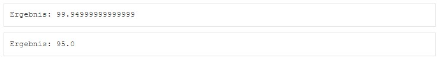
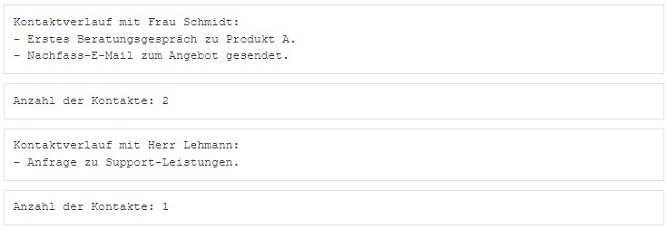

```{r setup, include=FALSE}
library(learnr)
library(reticulate)
library(pythonforbusiness)
```

## Willkommen

Dieses Tutorial ergänzt die Inhalte des Buches [_Künstliche Intelligenz im Business: Erstellung eigener Anwendungen mit Python_](https://www.amazon.de/K%C3%BCnstliche-Intelligenz-Business-Erstellung-Anwendungen/dp/3658495448).

Das Kapitel 5.5 im Buch beschreibt die Nutzung von Funktionen und Methoden in Python.

Die essenziellsten Funktionen und Methoden werden durch Python bereits in der Standardinstallation bereitgestellt. Darüber hinaus können weitere Funktionen und Methoden durch die Installation von Paketen zur Verfügung gestellt werden. Im Folgenden wird zunächst vorgestellt, wie Funktionen und Methoden aufgerufen werden können. Anschließend wird erklärt, wie eigene Funktionen und Methoden erstellt bzw. programmiert werden können.

Methoden unterscheiden sich von Funktionen nur dadurch, dass sie an ein Objekt gebunden sind während Funktionen direkt aufgerufen werden können. So handelt es sich bei print() um eine Funktion, bei std() um eine Methode, die nur auf einen Dataframe angewendet werden kann, z.B. auf den Dataframe df1 mit df1.std(). Die verfügbaren Methoden für Objekte eines Datentyps lassen sich für Float-Zahlen, Integer-Zahlen, Strings, Boolean-Variablen, Listen, Sets und Bibliotheken über die Funktionen dir(float), dir(int), dir(str), dir(bool),  dir(list), dir(set) und dir(dict) anzeigen. Eine Übersicht der Methoden für Arrays finden sich in der Dokumentation des Pakets numpy und die Methoden für Dataframes in der Dokumentation des Pakets pandas.

## 1. Funktionen und Methoden aufrufen

Funktionen und Methoden folgen einer einheitlichen Grundstruktur. Sie besitzen einen Namen und werden mit Klammern aufgerufen. Innerhalb der Klammer können der Funktion Argumente bzw. Parameter mitgegeben werden, also Funktionsname(Argumentname1 = Wert1, Argumentname2 = Wert2, ...), z.B. print("Dies ist eine Demonstration"). Die Argumente in der Klammer sind durch ein Komma voneinander getrennt. Die Reihenfolge, in welcher die Argumente beim Aufruf mitgegeben werden ist beliebig, sofern die Namen der Argumente angegeben werden. Gibt man die Namen der Argumente nicht an, muss man sich an die in der Funktionsdefinition vorgegebene Standard-Reihenfolge halten. Die Namen und Reihenfolge der Argumente ebenso wie Standardwerte (default values) kann man der Hilfeseite einer Funktion entnehmen, z.B. help(print) oder durch die Anzeige der Dokumentation einer Funktion mit der Methode __doc__, z.B. print.__doc__.

Die Argumente, auch Parameter genannt, können sowohl konkrete Werte (Zahlen, Zeichenketten…), Variablen beliebigen Datentyps, Datenstrukturen beliebigen Typs als auch Funktionen sein. Es ist also möglich, dass eine Funktion bzw. Methode als Parameter an eine andere Funktion übergeben wird, z.B. print(df1.head(2)).

In Python besteht ein Unterschied, ob Methoden auf Referenzkopien (identische Arbeitsspeicheradresse) oder Wertkopien (unterschiedliche Arbeitsspeicheradresse) angewendet werden. Eine Wertkopie eines Objektes kann mit der Methode copy() erzeugt werden. Wird eine Methode auf eine Referenzkopie angewendet, so ändern sich die Inhalte für beide Variablen, da der gleiche Bereich im Arbeitsspeicher verwendet wird. Wird dagegen eine Methode auf eine Wertkopie angewendet, so wirkt sich dies ausschließlich auf die Wertkopie aus.

```{python 1, exercise=FALSE}
## Funktion aufrufen--------------------------------------------------------------
import numpy as np                       # Numpy
import pandas as pd                      # Pandas
l1=["Tobi","Silke","Klaus","Tobi"]       # Liste l1
l2=[42,356,123,200]                      # Liste l2 (Facebook Freunde)
l3=[53,22,31,26]                         # Liste l3 (Alter)
df1=pd.DataFrame(list(zip(l1,l2,l3)),columns=["Freund","Facebook","Alter"])
df1                                      # Dataframe
## Übersicht der Methoden---------------------------------------------------------
dir(list)
## Dokumentation einer Funktion anzeigen------------------------------------------
help(print)
print.__doc__
## Aufruf von Funktion------------------------------------------------------------
print("Dies ist eine Demonstration")     # Einfacher Parameter
print(df1.head(2))                       # Methode head als Parameter
## Aufruf von Methode-------------------------------------------------------------
df1.tail(3)                              # Einfacher Parameter
## Methoden auf Kopien anwenden---------------------------------------------------
l4=[142,33,65,260]                       # Liste l4
l5=l4                                    # Liste l5 als Referenzkopie
id(l4)                                   # Arbeitsspeicheradresse = id
id(l5)                                   # Arbeitsspeicheradresse = id
l4 is l5                                 # L5 ist Referenzkopie ->True
print(l4,l5)
l5.pop(0)                                # pop löscht Element mit Index n
print(l4,l5)                             # Da Referenzkopie -> Änderung beider
l6=[533,100,8,2]                         # Liste l6
l7=l6.copy()                             # Liste l7 als Wertkopie
id(l6)                                   # Arbeitsspeicheradresse = id
id(l7)                                   # Arbeitsspeicheradresse = id
l6 is l7                                 # L5 ist keine Referenzkopie ->False
print(l6,l7)
l7.pop(2)                                # pop löscht Element mit Index n
print(l6,l7)                             # Da Wertkopie -> Änderung nur l7
```

### 1.1 Übung zu Funktionen und Methoden aufrufen


Sie sind in der Abteilung E-Commerce Analytics tätig. Für eine Schnellanalyse möchten Sie Produktnamen einheitlich umformatieren und auswerten – ganz ohne eigene Funktionen zu schreiben. Sie nutzen dafür ausschließlich bereits in Python enthaltene Funktionen und Methoden.

```{python 1_1-setup, echo=TRUE, exercise=FALSE}
produkte = ["Laptop", "Tastatur", "Maus", "Monitor", "Lautsprecher"]
```

Aufgabenstellung: Verwenden Sie die eingebaute Funktion map(), um die Methode str.upper auf jedes Element der Liste anzuwenden. Speichern Sie das Ergebnis in einer neuen Liste und geben Sie diese aus. Sortieren Sie die resultierende Liste alphabetisch mit der eingebauten Funktion sorted(). Auch hier sollen Sie keine eigene Funktion schreiben – verwenden Sie nur vorhandene Python-Features. Geben Sie beide Listen aus:
- Die Liste mit den in Großbuchstaben formatierten Produktnamen
- Die alphabetisch sortierte Variante davon

Die Anzeige sollte hinterher wie folgt aussehen: 

```{python 1_1, exercise=TRUE, exercise.setup="1_1-setup"}
```
```{python 1_1-hint-1}
produkte_upper = list(map(str.upper, produkte))
produkte_sortiert = sorted(produkte_upper)
print("In Großbuchstaben:", produkte_upper)
print("Alphabetisch sortiert:", produkte_sortiert)
```

## 2. Eigene Funktionen

Oft möchte man sich eigene Funktionen erstellen, wenn es keine passenden Funktionen in einem der Pakete gibt oder man keine solche Funktion kennt. Auch Funktionen sind Objekte in Python, welche im Arbeitsspeicher abgelegt werden, und sie bestehen aus dem Funktionskopf und dem Funktionsrumpf. Der Name der Funktion und deren Funktionskopf wird durch das Kennwort def eingeleitet, z.B. def funktion1. Als Funktionskopf gilt der Inhalt der runden Klammern der Funktion def funktion1(x,y), in dem die Argumente bzw. Parameter der Funktion bestimmt werden. Entsprechend der schwachen Typisierung von Python werden die Argumente ohne Datentyp angegeben. Der Funktionsrumpf wird durch einen Doppelpunkt eingeleitet und enthält die Anweisungen, die durch die Funktion ausgeführt werden sollen. Die Funktion return bestimmt, was die Funktion zurückgibt und in der Konsole erscheint und beendet gleichzeitig auch die Ausführung der Funktion. Zusätzliche Ausgaben können mit der Funktion print() festgelegt werden. Die Anweisung break bricht eine Funktion bzw. Schleife ab und continue überspringt die Rückgabe eines Wertes.

Die Dokumentation einer Funktion kann mit der Methode __doc__ angezeigt werden. Eine Dokumentation der eigenen Funktion erfolgt nach dem Funktionskopf in dem Bereich, der durch drei Hochkomma eingeschlossen ist.

Es ist auch möglich die Argumente einer Funktion mit einem Standardwert zu versehen, zum Beispiel def funktion2(x,y=6). Wenn die Funktion dann ohne den Parameter y, also funktion2(15) aufgerufen wird, so wird die Zahl 6 für y als Standard eingesetzt. Der Aufruf einer Funktion kann auch immer mit angegebenen Parameternamen erfolgen, z.B. funktion2(x=15,y=3).

```{python 2, exercise=FALSE}
## Funktion erstellen-------------------------------------------------------------
import numpy as np                              # Numpy
import pandas as pd                             # Pandas
def funktion1(x,y):                             # Neue Funktion
  """                                           # Beginn der Dokumentation
  Die "Funktion1" berechnet die Zahl: (x+y)/y.
  Parameter: x: Zahl, y: Zahl
  Ergebnis: float
  """                                           # Ende der Dokumentation
  z=x+y
  return(z/y)
print(funktion1.__doc__)                        #__doc__ zeigt Dokumentation an
funktion1(15,3)                                 # Aufruf Argument xy
funktion1(3,15)                                 # Aufruf Argument xy
funktion1(x=15,y=3)                             # Aufruf mit Name und Argument xy
funktion1(y=3,x=15)                             # Aufruf mit Name und Argument yx
def funktion2(x,y=6):                           # Neue Funktion mit Standard y=6
  z=x+y
  return(z/y)
funktion2(15)                                   # Aufruf mit Argument x
funktion2(x=15)                                 # Aufruf mit Name und Argument x
funktion2(15,3)                                 # Aufruf Argument xy
funktion2(3,15)                                 # Aufruf Argument xy
funktion2(x=15,y=3)                             # Aufruf mit Name und Argument xy
funktion2(y=3,x=15)                             # Aufruf mit Name und Argument yx
def funktion3(x):                               # Funktion3 Rückgabe: Float
  return(np.mean(x))
l1=[42,356,123,200]
l1
funktion3(l1)                                   
def funktion4(x):                               # Funktion4 Rückgabe: Float
  print("Mittelwert von:",x)                    # mit Print
  return(np.mean(x))
funktion4(l1)                                   
rückgabewert4=funktion4(l1)
type(rückgabewert4)
rückgabewert4
def funktion5(x):                               # Funktion5 Rückgabe: nichts
  print("Mittelwert von:",x,"= ",np.mean(x))    # mit Print
  letzterwert=np.mean(x)                        
rückgabewert5=funktion5(l1)
type(rückgabewert5)
rückgabewert5
def funktion6(x):                               # Funktion6 Rückgabe: Liste
  print("Mittel, Max, Min von:",x,"=","\n")     # mit Print
  return(list((np.mean(x),np.max(x),np.min(x))))
rückgabewert6=funktion6(l1)                     
type(rückgabewert6)
rückgabewert6
def funktion7(x):                               # Funktion7 Rückgabe: Dataframe
  print("Mittel, Max, Min von:",x,"=",np.mean(x),np.max(x),np.min(x),"\n")
  df=pd.DataFrame([np.mean(x),np.max(x),np.min(x)])
  df.index=["Mittelwert","Maximum","Minimum"]
  return(df)
rückgabewert7=funktion7(l1)
type(rückgabewert7)
rückgabewert7
```

### 2.1 Eigene Funktionen mit beliebig vielen Parametern

Eine Funktion kann auch für eine unbestimmte bzw. dynamische Anzahl von Argumenten etabliert werden, wenn das *-Symbol (Asterisk) für ein Tupel oder ein doppeltes **-Symbol für ein Dictionary verwendet wird. Es hat sich die Konvention für die Schreibweise mit *args (Argumente) sowie **kwargs (Keywort-Argumente) etabliert.

Alle Argumente einer Funktion werden grundsätzlich wie bei einem "call by value" und nicht einem "call by reference" übergeben, was bedeutet, dass die Werte nach Abschluss der Funktion unverändert sind, also deren Wert lediglich lokal innerhalb der Funktion verändert werden kann. Auch alle innerhalb der Funktion neu erstellten Variablen existieren nach dem Beenden der Funktion nicht mehr.

```{python 2_1, exercise=F}
## Funktion mit beliebiger Anzahl Parameter---------------------------------------
def funktion8(*args):
  ergebnis=float()
  for arg in args:
    ergebnis+=float(arg)
  return(ergebnis)                            
rückgabewert8=funktion8(1,3,"7",100)
type(rückgabewert8)
rückgabewert8
def funktion9(*args,**kwargs):
  print(f"Liste der args:{args}")
  print(f"Liste der kwargs:{kwargs}")
funktion9("Zahlen",55,"Text1","Text2",6,Niemals="never",immer="always")
#- Funktion erstellen: Argumentübergabe immer "by value"--------------------------
zahl=2                                          # Globale Variable
zahl
def funktion9(zahl):
  print("Zahl in Funktion vor Addition:",zahl); # Lokale Variable
  zahl+=50                                      # Addition
  print("Zahl in Funktion nach Addition:",zahl) # Lokale Variable verändert 
  return(zahl)                               
rückgabewert9=funktion9(zahl)                   # Aufruf by value
rückgabewert9   
zahl                                            # Globale Variable unverändert
#- Funktionen mit Liste als Rückgabewert------------------------------------------
#  Funktionen können mehrere Rückgabewerte mit return zurückliefern, wenn diese 
#  vorher in einer Liste zusammengefügt wurden und alle vom gleichen Datentyp sind
def funktion10(para1,para2): 
  summe=para1+para2
  ergebnisliste=[summe,para1,para2]
  return ergebnisliste
funktion10(4,10)
```

### 2.2 Übung zu eigenen Funktionen

Sie arbeiten in der Abteilung Datenanalyse eines Unternehmens. Für ein internes Tool sollen Sie Funktionen und Methoden verwenden, um Kundendaten effizient zu verarbeiten.

```{python 2_2-setup, echo=TRUE, exercise=FALSE}
einzelbestellung = (19.99, 5)
kundenbestellungen = [(10.0, 2), (25.0, 1), (5.0, 10)]
```

Aufgabenstellung: Erstellen Sie eine Funktion berechne_umsatz, die zwei Parameter erhält: preis und anzahl. Die Funktion soll den Umsatz berechnen (Preis × Anzahl) und zurückgeben. Erstellen Sie eine Klasse Kunde mit den Attributen name und bestellungen (eine Liste von Tupeln der Form (preis, anzahl)). Fügen Sie eine Methode gesamtumsatz hinzu, die den Gesamtumsatz aller Bestellungen dieses Kunden berechnet.
Erstellen Sie eine Funktion verarbeite_berechnung, die zwei Parameter akzeptiert: eine Datenstruktur (z. B. ein Kunde-Objekt oder ein Tupel) und eine Funktion oder Methode, die auf diese Datenstruktur angewendet werden soll. Diese Funktion soll den übergebenen Funktions- oder Methodenaufruf durchführen und das Ergebnis ausgeben.
Legen Sie einen Kunden mit folgender Anweisung an: "kunde = Kunde("Herr Meier", kundenbestellungen)"
Verwenden Sie verarbeite_berechnung, um sowohl die Funktion berechne_umsatz mit Beispielwerten als auch die Methode gesamtumsatz eines Kunden mit folgender Syntax aufzurufen: "verarbeite_berechnung(einzelbestellung, berechne_umsatz)" und "verarbeite_berechnung(kunde, kunde.gesamtumsatz)".

Die Anzeige sollte hinterher wie folgt aussehen: 

```{python 2_2, exercise=TRUE, exercise.setup="2_2-setup"}
```
```{python 2_2-hint-1}
# Funktion zur Berechnung des Umsatzes
def berechne_umsatz(preis, anzahl):
    return preis * anzahl
# Klasse mit Methode
class Kunde:
    def __init__(self, name, bestellungen):
        self.name = name
        self.bestellungen = bestellungen
    def gesamtumsatz(self):
        return sum(preis * anzahl for preis, anzahl in self.bestellungen)
# Funktion, die eine andere Funktion oder Methode aufruft
def verarbeite_berechnung(daten, funktion):
    ergebnis = funktion(*daten) if isinstance(daten, tuple) else funktion()
    print("Ergebnis:", ergebnis)
```
```{python 2_2-hint-2}
# Funktion zur Berechnung des Umsatzes
kunde = Kunde("Herr Meier", kundenbestellungen)
verarbeite_berechnung(einzelbestellung, berechne_umsatz)
verarbeite_berechnung(kunde, kunde.gesamtumsatz)
```

## 3. Eigene Klassen

Python Klassen bieten die Vorteile der objektorientierten Programmierung wie Vererbung und mehrere Basisklassen sowie abgeleitete Klassen. Abgeleitete Klassen können jegliche Methoden ihrer Basisklasse überschreiben. Auch Klassen sind Objekte in Python, welche im Arbeitsspeicher abgelegt werden, und sie bestehen aus dem Klassenkopf und dem Klassenrumpf. Der Name der Klasse wird durch das Kennwort class eingeleitet, z.B. class klasse1. Der Klassenrumpf wird durch einen Doppelpunkt eingeleitet und enthält die Anweisungen, die aus Wertzuweisungen und Funktionsdefinitionen bestehen.

Die Instanziierungsoperation (“aufrufen” eines Klassenobjekts) erzeugt ein leeres Objekt, z.B. a=klasse1. Viele Klassen haben es gerne Instanzobjekte, die auf einen spezifischen Anfangszustand angepasst wurden, zu erstellen. Deshalb kann eine Klasse eine spezielle Methode namens __init__(), wie folgt definieren, z.B. def __init__(self): self.data = [].

```{python 3, exercise=F}
## Klasse erstellen---------------------------------------------------------------
class klasse1:                                  # Neue Klasse
  """                                           # Beginn der Dokumentation
  "klasse1" definiert 
  - Variable xy= 97 und
  - Funktion "funktion1", welche "Grüße aus Ansbach" ausgibt
  Parameter: keine
  """                                           # Ende der Dokumentation
  def __init__(self, anzahl):
       self.anzahl = anzahl
  def funktion1(anzahl):
    """                                         # Beginn der Dokumentation
    "funktion1" gibt "Grüße aus Ansbach" zurück
    Parameter: keine
    """                                         # Ende der Dokumentation
    return f"Grüße aus Ansbach von {anzahl} Personen."
  xy=97
## Dokumentation der Klasse-------------------------------------------------------
print(klasse1.__doc__)                          #__doc__ zeigt Dokumentation an
print(klasse1.funktion1.__doc__)                #__doc__ zeigt Dokumentation an
## Instanz einer Klasse anlegen---------------------------------------------------
a=klasse1
a.xy
a.funktion1(4)
```

### 3.1 Übung zu eigenen Klassen

Sie arbeiten im Bereich Customer Relationship Management (CRM) und sollen ein einfaches System entwickeln, um Kundendaten und deren Kommunikation zu verwalten. Ziel ist es, eine übersichtliche Struktur zur Speicherung und Auswertung von Informationen zu schaffen.

Aufgabenstellung: Erstellen Sie eine Klasse namens Kundenkontakt, die folgende Attribute enthält:
- kunde_name (Name des Kunden)
- email (E-Mail-Adresse des Kunden)
- kontaktverlauf (eine Liste von Strings, in der Gesprächsnotizen gespeichert werden)
Fügen Sie der Klasse folgende Methoden hinzu:
- hinzufuegen_notiz(self, notiz): Fügt eine neue Notiz zum Kontaktverlauf hinzu.
- anzahl_kontakte(self): Gibt die Anzahl der bisherigen Kontaktaufnahmen zurück.
- zeige_kontakte(self): Gibt den vollständigen Kontaktverlauf aus (eine Notiz pro Zeile).
Erstellen Sie zwei Instanzen der Klasse Kundenkontakt mit folgenden Daten:
Kunde 1
- Name: Frau Schmidt
- E-Mail: schmidt@example.com
- Notizen:
  „Erstes Beratungsgespräch zu Produkt A.“
  „Nachfass-E-Mail zum Angebot gesendet.“
Kunde 2
- Name: Herr Lehmann
- E-Mail: lehmann@example.com
- Notizen:
  „Anfrage zu Support-Leistungen.“
Wenden Sie alle Methoden der Klasse an:
- Fügen Sie die Notizen hinzu.
- Lassen Sie sich den Kontaktverlauf anzeigen.
- Geben Sie die Anzahl der Notizen pro Kunde aus.

Die Anzeige sollte hinterher wie folgt aussehen: 

```{python 3_1, exercise=TRUE}
```
```{python 3_1-hint-1}
class Kundenkontakt:
    def __init__(self, kunde_name, email):
        self.kunde_name = kunde_name
        self.email = email
        self.kontaktverlauf = []

    def hinzufuegen_notiz(self, notiz):
        self.kontaktverlauf.append(notiz)

    def anzahl_kontakte(self):
        return len(self.kontaktverlauf)

    def zeige_kontakte(self):
        print(f"Kontaktverlauf mit {self.kunde_name}:")
        for eintrag in self.kontaktverlauf:
            print("-", eintrag)
```
```{python 3_1-hint-2}
kontakt1 = Kundenkontakt("Frau Schmidt", "schmidt@example.com")
kontakt1.hinzufuegen_notiz("Erstes Beratungsgespräch zu Produkt A.")
kontakt1.hinzufuegen_notiz("Nachfass-E-Mail zum Angebot gesendet.")
kontakt1.zeige_kontakte()
print("Anzahl der Kontakte:", kontakt1.anzahl_kontakte())
print("\n")
kontakt2 = Kundenkontakt("Herr Lehmann", "lehmann@example.com")
kontakt2.hinzufuegen_notiz("Anfrage zu Support-Leistungen.")
kontakt2.zeige_kontakte()
print("Anzahl der Kontakte:", kontakt2.anzahl_kontakte())
```

## 4. Quiz 

```{r 4, echo = FALSE}
quiz(
  question("Wie wird eine Funktion in Python definiert?",
    answer("Mit 'def'", correct = TRUE),
    answer("Mit 'function'", correct = FALSE)
  ),
  question("Wie gibt eine Funktion Werte zurück?",
    answer("Mit 'return'", correct = TRUE),
    answer("Mit 'print'", correct = FALSE)
  ),
  question("Wie kann eine Funktion eine beliebige Anzahl von Argumenten annehmen?",
    answer("Mit '*args'", correct = TRUE),
    answer("Mit '&args'", correct = FALSE)
  ),
  question("Wie wird eine Klasse in Python definiert?",
    answer("Mit 'class'", correct = TRUE),
    answer("Mit 'object'", correct = FALSE)
  ),
  question("Was macht die Methode __init__ in einer Klasse?",
    answer("Sie initialisiert ein Objekt", correct = TRUE),
    answer("Sie gibt das Objekt aus", correct = FALSE)
  ),
  question("Welche Methode wird aufgerufen, um eine Methode einer Klasse zu verwenden?",
    answer("Mit einem Punktoperator, z.B. obj.methode()", correct = TRUE),
    answer("Mit einem Doppelpunkt, z.B. obj:methode()", correct = FALSE)
  ),
  question("Wie kann eine Funktion mit einem Standardwert aufgerufen werden?",
    answer("Indem der Parameter nicht explizit angegeben wird", correct = TRUE),
    answer("Indem ein zweiter Parameter 'default' übergeben wird", correct = FALSE)
  ),
  question("Welche Funktion gibt die Dokumentation einer Funktion aus?",
    answer("__doc__", correct = TRUE),
    answer("info()", correct = FALSE),
    answer("doc()", correct = FALSE)
  ),
  question("Wie kann eine Klasse instanziiert werden?",
    answer("Mit dem Klassennamen und Klammern, z.B. obj = Klasse()", correct = TRUE),
    answer("Mit der Methode create(), z.B. obj = Klasse.create()", correct = FALSE)
  ),
  question("Was passiert, wenn ein Standardparameter nicht angegeben wird?",
  answer("Es wird der voreingestellte Wert verwendet", correct = TRUE),
  answer("Es tritt ein Fehler auf", correct = FALSE)
  )
)
```

## Ende 

Gratulation!

Sie haben dieses Tutorial erfolgreich ausgeführt und einen ersten Einblick in die Erstellung und Nutzung von Funktionen, Methoden und Klassen in der Programmiersprache Python erhalten.