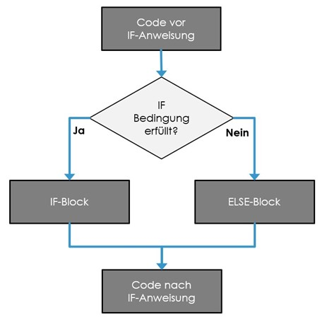
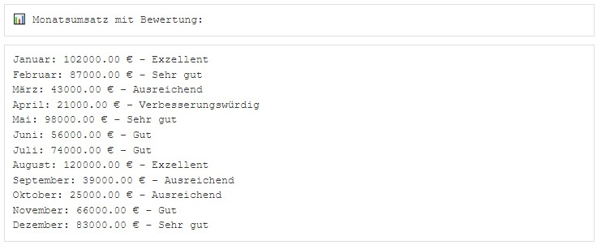
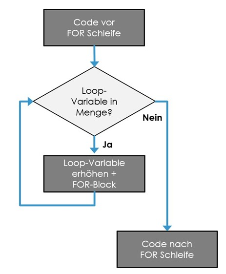
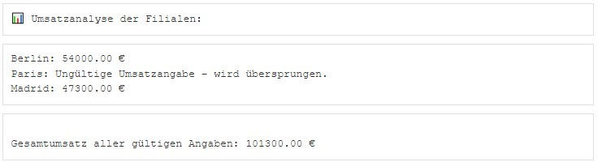
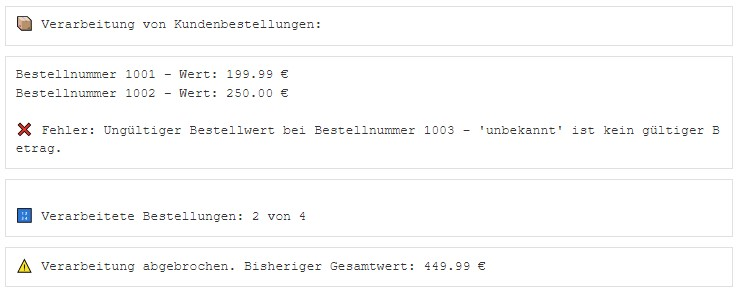

```{r setup, include=FALSE}
library(learnr)
library(reticulate)
library(pythonforbusiness)
```

## Willkommen

Dieses Tutorial ergänzt die Inhalte des Buches [_Künstliche Intelligenz im Business: Erstellung eigener Anwendungen mit Python_](https://www.amazon.de/K%C3%BCnstliche-Intelligenz-Business-Erstellung-Anwendungen/dp/3658495448).

Das Kapitel 5.4 im Buch beschreibt Kontrollstrukturen von Python.

Auch in Python existieren die in Programmiersprachen üblichen Kontrollstrukturen if, else und Schleifen vom Typ for und while, um Programmlogik abzubilden. 

## 1. IF-Anweisung

Eine if/else-Anweisung folgt folgender Syntax: if (Bedingung): Anweisungsblock-if else Anweisungsblock-else oder bei mehr als zwei Fallunterscheidungen if (Bedingung): Anweisungsblock-if elif (Bedingung-2) Anweisungsblock-2 else Anweisungsblock-else, wie im nachfolgenden Bild dargestellt: .

```{python 1, exercise=FALSE}
import pandas as pd                     # Pandas für Dataframe
a,b,c= 1,2,3
## IF-Anweisung-------------------------------------------------------------------
b>a
if b>a: 
  print("B ist größer als a")
else:
  print("B ist nicht größer als a") 
## IF/ELIF Anweisung--------------------------------------------------------------
if b<a: 
  print("B ist kleiner als a")
elif (c<b):
  print("C ist kleiner als b") 
else:
  print("Weder B ist kleiner als a noch ist c kleiner als b")
```

### 1.1 Übung zu IF-Anweisung

Sie arbeiten in der Unternehmensanalyse und sollen die Umsätze der vergangenen 12 Monate bewerten.Das Unternehmen hat die Monatsumsätze bereits zur Verfügung gestellt. Ihre Aufgabe ist es, jeden Monat einzeln zu bewerten. Die Bewertung erfolgt nach folgender Skala:

Umsatz (€)	      Bewertung
Über 100.000	    Exzellent
75.000 – 100.000	Sehr gut
50.000 – 74.999	  Gut
25.000 – 49.999	  Ausreichend
Unter 25.000	    Verbesserungswürdig

```{python 1_1-setup, echo=TRUE, exercise=FALSE}
monate = [
    "Januar", "Februar", "März", "April", "Mai", "Juni",
    "Juli", "August", "September", "Oktober", "November", "Dezember"
]
umsaetze = [
    102000, 87000, 43000, 21000, 98000, 56000,
    74000, 120000, 39000, 25000, 66000, 83000
]
```

Aufgabenstellung: Verwenden Sie eine Schleife, um über alle Monate zu iterieren. Nutzen Sie if, elif, else, um die Bewertung jedes Umsatzes zu bestimmen. Geben Sie eine Liste mit Monat, Umsatz und Bewertung aus.

Die Anzeige sollte hinterher wie folgt aussehen: 

```{python 1_1, exercise=TRUE, exercise.setup="1_1-setup"}
```
```{python 1_1-hint-1}
print("📊 Monatsumsatz mit Bewertung:\n")
for i in range(len(monate)):
    monat = monate[i]
    umsatz = umsaetze[i]
    if umsatz > 100000:
        bewertung = "Exzellent"
    elif umsatz >= 75000:
        bewertung = "Sehr gut"
    elif umsatz >= 50000:
        bewertung = "Gut"
    elif umsatz >= 25000:
        bewertung = "Ausreichend"
    else:
        bewertung = "Verbesserungswürdig"
    print(f"{monat}: {umsatz:.2f} € – {bewertung}")
```

## 2. FOR-Schleife

Eine for-Schleife folgt folgender Syntax: for Variable in Liste: Anweisungsblock, wie im nachfolgenden Bild dargestellt: .

```{python 2, exercise=F}
## FOR-Schleife-------------------------------------------------------------------
l1=["Tobi","Silke","Klaus","Tobi"]       # Liste l1
for i in l1:
  print(i)
l2=[42,356,123,200]                      # Liste l2 (Facebook Freunde)
l3=[53,22,31,26]                         # Liste l3 (Alter)
df1=pd.DataFrame(list(zip(l1,l2,l3)),columns=["Freund","Facebook","Alter"])
df1                                      # Dataframe
df1.shape
for z in range(df1.shape[0]):            # Zeilenweise Ausgabe
  print(df1.iloc[z,])
for s in range(df1.shape[1]):
  for z in range(df1.shape[0]):
    print("Spalte/Zeile[",s,",",z,"]=",df1.iloc[z,s])
l4=[6,8,"1.23",5.78,"Text"]
for element in l4:                       # Try und Except Fehlerbehandlung
  try:
    if type(element) == str:
      if "." in element:
        num = float(element)
      else:
        num = int(element)
    print(element)
    f"Element '{element}' ist eine Zahl"
  except ValueError as e:
    print(e)
```

### 2.1 Übung zu For-Anweisung

Sie sind Controller und ihr Unternehmen betreibt Filialen in mehreren europäischen Städten.

```{python 2_1-setup, echo=TRUE, exercise=FALSE}
filialen = {
    "Berlin": 54000,
    "Paris": "keine Angabe",  # Ungültiger Wert
    "Madrid": 47300
}
gesamtumsatz = 0
```

Aufgabenstellung: Sie analysieren Umsätze dreier europäischer Filialen. Eine der Angaben liegt versehentlich im falschen Format vor. Ihr Programm soll diesen Fall erkennen, überspringen, und dennoch den Gesamtumsatz berechnen.

Die Anzeige sollte hinterher wie folgt aussehen: 

```{python 2_1, exercise=TRUE, exercise.setup="2_1-setup"}
```
```{python 2_1-hint-1}
print("📊 Umsatzanalyse der Filialen:\n")
for stadt, umsatz in filialen.items():
    try:
        betrag = float(umsatz)
        print(f"{stadt}: {betrag:.2f} €")
        gesamtumsatz += betrag
    except ValueError:
        print(f"{stadt}: Ungültige Umsatzangabe – wird übersprungen.")
print(f"\nGesamtumsatz aller gültigen Angaben: {gesamtumsatz:.2f} €")
```

## 3. While-Schleife

Eine while-Schleife folgt folgender Syntax: while (Bedingung): Anweisungsblock und läuft solange die Bedingung erfüllt ist oder bis die Funktion break() ausgeführt wird. Wird die Bedingung nicht erreicht und auch keine break()-Funktion ausgeführt, dann führt dies zu einer Endlosschleife. Im nachfolgenden Bild ist die Logik dargestellt: .

```{python 3, exercise=F}
## WHILE-Schleife-----------------------------------------------------------------
i1=1
while i1 <= 3:                           # Index-Schleife
  print("Schleifendurchlauf",i1,"\n")
  i1+=1
i2=29
while(i2>10):                            # Boolean-Schleife
  print("Zahl:",i2)
  i2-=3
  if i2==19:
    break
print("Zahl am Ende:",i2)
i2=28                                    # Abbruch durch break
while(i2>10):
  print("Zahl:",i2)
  i2-=3
  if i2==19:
    break
print("Zahl am Ende:",i2)
```

### 3.1 Übung zu While-Anweisung

Sie erhalten eine Tabelle mit Bestellungen in Form eines DataFrames. Jede Bestellung enthält den Bestellwert in Euro. Eine der Angaben ist fehlerhaft (z. B. ein Text statt einer Zahl).

```{python 3_1-setup, echo=TRUE, exercise=FALSE}
daten = {
    "Bestellnummer": [1001, 1002, 1003, 1004],
    "Bestellwert (€)": [199.99, 250.00, "unbekannt", 320.00]
}
df = pd.DataFrame(daten)
```

Aufgabenstellung: Ihre Aufgabe ist es, alle Bestellungen nacheinander mit einer while-Schleife zu verarbeiten und den Gesamtwert zu berechnen. Falls ein Fehler auftritt, bricht das Programm ab, zeigt die Fehlermeldung, und listet die Anzahl und den Wert der bis dahin verarbeiteten Bestellungen auf.

Die Anzeige sollte hinterher wie folgt aussehen: 

```{python 3_1, exercise=TRUE, exercise.setup="3_1-setup"}
```
```{python 3_1-hint-1}
gesamtwert = 0.0
verarbeitet = 0
gesamtanzahl = len(df)
print("📦 Verarbeitung von Kundenbestellungen:\n")
index = 0
while index < gesamtanzahl:
    bestellung = df.iloc[index]
    bestellnummer = bestellung["Bestellnummer"]
    wert = bestellung["Bestellwert (€)"]
    try:
        wert_float = float(wert)
        print(f"Bestellnummer {bestellnummer} – Wert: {wert_float:.2f} €")
        gesamtwert += wert_float
        verarbeitet += 1
    except ValueError:
        print(f"\n❌ Fehler: Ungültiger Bestellwert bei Bestellnummer {bestellnummer} – '{wert}' ist kein gültiger Betrag.")
        break
    index += 1
```
```{python 3_1-hint-2}
print(f"\n🔢 Verarbeitete Bestellungen: {verarbeitet} von {gesamtanzahl}")
if verarbeitet == gesamtanzahl:
    print(f"✅ Gesamtwert aller Bestellungen: {gesamtwert:.2f} €")
else:
    print(f"⚠️ Verarbeitung abgebrochen. Bisheriger Gesamtwert: {gesamtwert:.2f} €")
```

## 4. Quiz 

```{r 4, echo = FALSE}
quiz(
  question("Welche Schleife eignet sich für das Iterieren durch eine Liste?",
    answer("for", correct = TRUE),
    answer("while", correct = FALSE)
  ),
  question("Welche Anweisung beendet eine Schleife vorzeitig?",
    answer("break", correct = TRUE),
    answer("stop", correct = FALSE)
  ),
  question("Was passiert, wenn die Bedingung in einer while-Schleife niemals False wird?",
    answer("Die Schleife läuft unendlich", correct = TRUE),
    answer("Die Schleife wird übersprungen", correct = FALSE)
  ),
  question("Welche Kontrollstruktur erlaubt eine Alternative für if-Bedingungen?",
    answer("elif", correct = TRUE),
    answer("else if", correct = FALSE)
  ),
  question("Welche Schleife eignet sich für das wiederholte Prüfen einer Bedingung?",
    answer("while", correct = TRUE),
    answer("for", correct = FALSE)
  ),
  question("Was bewirkt die continue-Anweisung?",
    answer("Überspringt den aktuellen Schleifendurchlauf", correct = TRUE),
    answer("Beendet die Schleife", correct = FALSE)
  ),
  question("Wie wird eine for-Schleife korrekt geschrieben?",
    answer("for i in range(5):", correct = TRUE),
    answer("for(i=0; i<5; i++)", correct = FALSE)
  ),
  question("Welche Schleife überprüft die Bedingung vor der ersten Iteration?",
    answer("while", correct = TRUE),
    answer("for", correct = FALSE)
  ),
  question("Was gibt 'if 5 > 3: print(\"Ja!\")' aus?",
    answer("Ja!", correct = TRUE),
    answer("Fehler", correct = FALSE)
  ),
  question("Welche Anweisung ermöglicht eine zusätzliche Bedingung nach 'if'?",
    answer("elif", correct = TRUE),
    answer("elseif", correct = FALSE)
  )
)
```

## Ende 

Gratulation!

Sie haben dieses Tutorial erfolgreich ausgeführt und einen ersten Einblick in die Syntax der Programmiersprache Python erhalten.